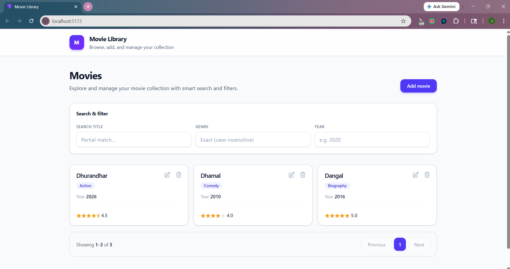
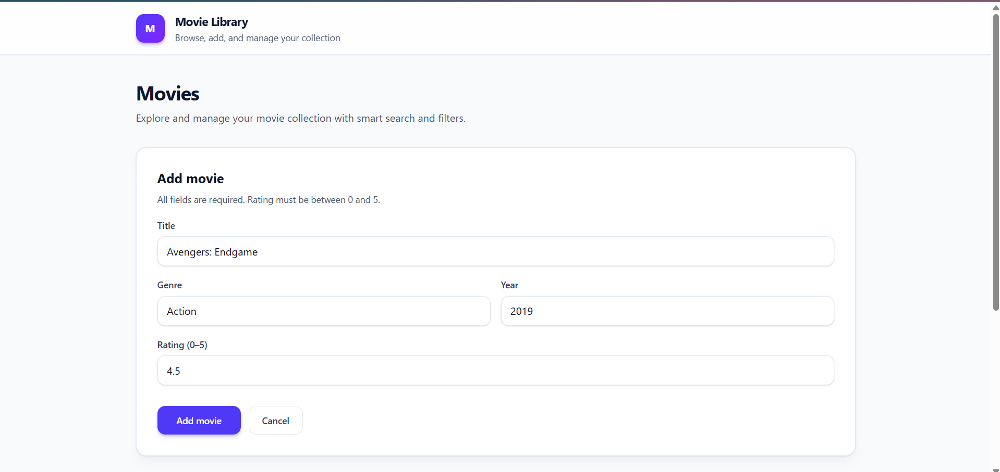
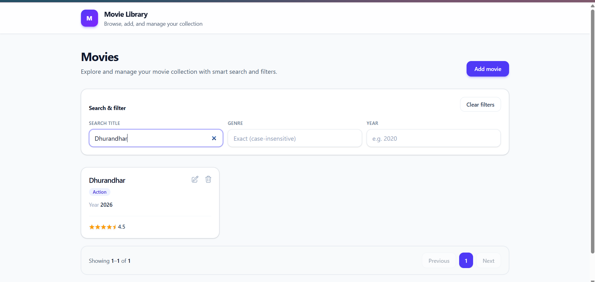
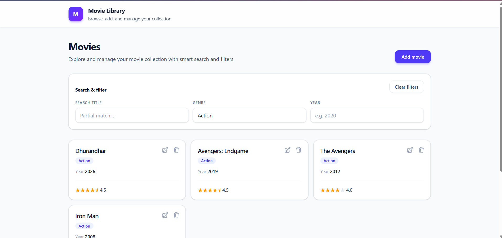
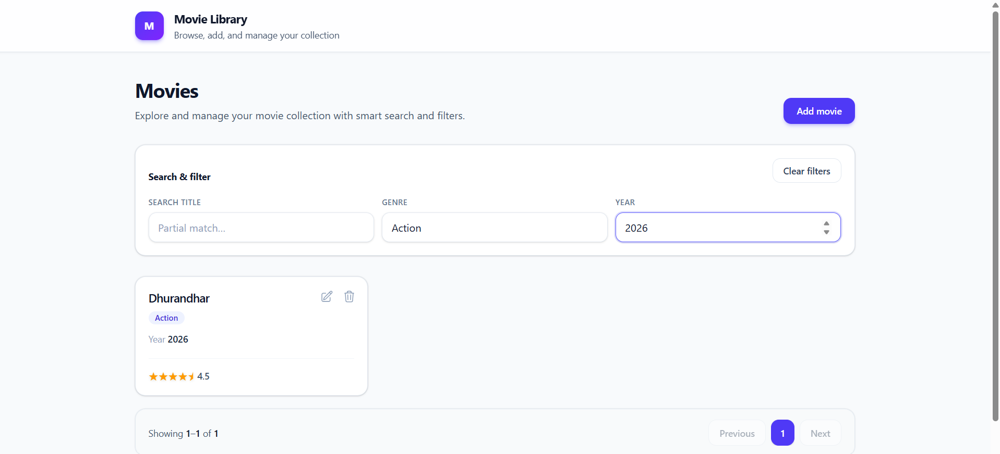
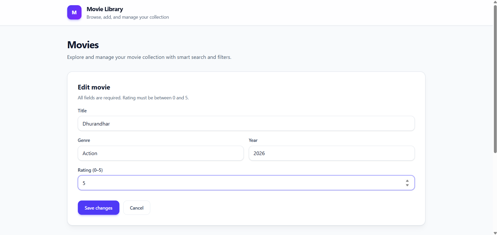
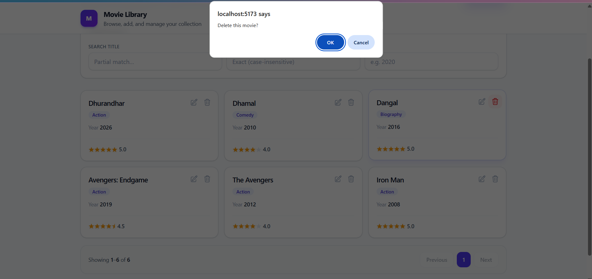

# Movie Management WebApp

A modern, full-stack web application for managing movie collections with a clean and intuitive interface. This application demonstrates best practices in React frontend development and Go backend API design with MongoDB integration.

## Overview

The Movie Management WebApp allows users to:
- Create, read, update, and delete movies
- Filter movies by title, genre, and year
- Rate movies with a 5-star rating system
- Paginated movie listings
- Real-time validation and error handling
- Responsive design with modern UI

## Tech Stack

### Frontend
- **React 19.2.4** - Modern React with latest features
- **Vite 8.0.4** - Fast development server and build tool
- **TailwindCSS 4.2.2** - Utility-first CSS framework for styling
- **Axios 1.15.0** - HTTP client for API communication
- **React Hot Toast 2.6.0** - Beautiful toast notifications

### Backend
- **Go 1.26.2** - High-performance backend language
- **Gin 1.12.0** - HTTP web framework
- **CORS** - Cross-origin resource sharing support

### Database
- **MongoDB** - NoSQL document database for movie storage

## Project Structure

```
Movie_Management_WebApp/
|
backend/
|   config/
|   |   config.go      # Application configuration
|   |   db.go          # Database connection management
|   controllers/
|   |   health_controller.go  # Health check endpoints
|   |   movie_controller.go   # Movie CRUD operations
|   models/
|   |   movie.go       # Movie data model and validation
|   routes/
|   |   routes.go      # API route definitions
|   main.go            # Application entry point
|   go.mod             # Go module dependencies
|   go.sum             # Dependency checksums
|
frontend/
|   public/
|   |   favicon.svg    # Application favicon
|   |   icons.svg      # Application icons
|   src/
|   |   components/
|   |   |   AppToaster.jsx         # Toast notification system
|   |   |   Layout.jsx             # Main layout component
|   |   |   MovieFilters.jsx       # Movie filtering controls
|   |   |   MovieForm.jsx          # Add/Edit movie form
|   |   |   MovieGridSkeleton.jsx  # Loading skeleton
|   |   |   MovieList.jsx          # Movie list container
|   |   |   MoviePagination.jsx    # Pagination controls
|   |   |   MovieTile.jsx          # Individual movie card
|   |   |   RefreshBar.jsx         # Refresh controls
|   |   |   StarRating.jsx         # Star rating component
|   |   pages/
|   |   |   HomePage.jsx           # Home page component
|   |   |   MoviesPage.jsx         # Main movies page
|   |   App.jsx                    # Root application component
|   |   main.jsx                   # Application entry point
|   |   index.css                  # Global styles
|   package.json                  # Node.js dependencies
|   vite.config.js                 # Vite configuration
```

## Features

### Movie Management
- **Create Movies**: Add new movies with title, genre, year, and rating
- **Read Movies**: View movies in a responsive grid layout
- **Update Movies**: Edit existing movie details
- **Delete Movies**: Remove movies from the collection
- **Validation**: Real-time field validation with user-friendly error messages

### Search & Filter
- **Title Search**: Partial, case-insensitive title matching
- **Genre Filter**: Exact genre matching
- **Year Filter**: Filter by release year
- **Combined Filters**: Apply multiple filters simultaneously

### User Experience
- **Pagination**: Efficient pagination with configurable page sizes
- **Loading States**: Skeleton loaders for better perceived performance
- **Toast Notifications**: Non-intrusive success/error messages
- **Responsive Design**: Works seamlessly on desktop and mobile devices
- **Star Ratings**: Interactive 5-star rating system

## API Endpoints

### Movies
- `GET /api/movies` - List movies with filtering and pagination
- `POST /api/movies` - Create a new movie
- `PUT /api/movies/:id` - Update an existing movie
- `DELETE /api/movies/:id` - Delete a movie

### Health Check
- `GET /api/health` - Application health status

### Query Parameters (for GET /api/movies)
- `title` - Partial title search (case-insensitive)
- `genre` - Exact genre match (case-insensitive)
- `year` - Exact year match
- `page` - Page number (default: 1)
- `limit` - Items per page (default: 10, max: 100)

## Data Model

### Movie
```json
{
  "id": "string (ObjectId)",
  "title": "string (required)",
  "genre": "string (required)",
  "year": "integer (1900-current year)",
  "rating": "number (0-5)"
}
```

### Validation Rules
- **Title**: Required, must be unique (case-insensitive)
- **Genre**: Required
- **Year**: Must be between 1900 and current year
- **Rating**: Must be between 0 and 5

## Getting Started

### Prerequisites
- Go 1.26.2 or higher
- Node.js 18 or higher
- MongoDB instance (local or cloud)

### Installation

1. **Clone the repository**
   ```bash
   git clone <repository-url>
   cd Movie_Management_WebApp
   ```

2. **Backend Setup**
   ```bash
   cd backend
   go mod download
   ```

3. **Frontend Setup**
   ```bash
   cd frontend
   npm install
   ```

4. **Environment Configuration**
   
   Create a `.env` file in the `backend` directory:
   ```env
   PORT=8080
   MONGODB_URI=mongodb://localhost:27017/movie_management
   ```

### Running the Application

1. **Start MongoDB**
   ```bash
   # For local MongoDB
   mongod
   ```

2. **Start the Backend**
   ```bash
   cd backend
   go run main.go
   ```
   The backend will start on `http://localhost:8080`

3. **Start the Frontend**
   ```bash
   cd frontend
   npm run dev
   ```
   The frontend will start on `http://localhost:5173`

## Screenshots

### 1. Main Dashboard

The main dashboard displaying all movies in a responsive grid layout with search and filter options.

### 2. Add Movie

The add movie form where users can input movie details including title, genre, year, and rating.

### 3. Search by Name

Search functionality allowing users to find movies by title with real-time filtering.

### 4. Search by Genre

Genre-based filtering to browse movies by specific categories.

### 5. Search by Year

Year-based filtering to find movies from specific release years.

### 6. Edit Movie

The edit movie interface for updating existing movie information.

### 7. Delete Movie

Movie deletion functionality with confirmation dialog for removing movies from the collection.

---

**Built with React, Go, and MongoDB**
